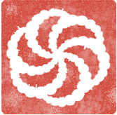

#  Codewarrior bot

Handy codewars telegram bot, can track personal progress, achievements, suggest & search for katas and many more!

## Why telegram?

One of the most popular messangers in CIS countries with large & easy to use bot ecosystem

## Usage

Bot's functionality depends on codewars API, so just use specified commands below (Some of them work only in group chats!).

### Commands

- `/warrior :username` - get personal info of @username
- `/badge :username` - get rank badge of @username
- `/random_kata` - get any random kata (**INACCESSIBLE** cw API doesn't have this route yet)

  #### **Group chat commands**

  - `/leaderboard` - get a leaderboard of registered chat members
  - `/regme` - add your cw account for stats
  - `/unregme` - remove your cw account from stats

## Contribution

Feel free to contribute to this project any time!

Just follow the prepared steps in [Contribution docs](./docs/CONTRIBUTION.md)

## Licence

This project is licensed under the [MIT license](./LICENSE)